# GoLanka Courier — Parcel Management System

> Web application for parcel creation, tracking and dashboard management for customers, drivers and staff.

---

## Table of contents

- [Project Description](#project-description)
- [Features](#features)
- [Tech stack](#tech-stack)
- [Demo video (required)](#demo-video-required)
- [Screenshots](#screenshots)
- [Repository structure](#repository-structure)
- [Setup & run instructions](#setup--run-instructions)
    - [Prerequisites](#prerequisites)
    - [Backend (Spring Boot)](#backend-spring-boot)
    - [Frontend (static)](#frontend-static)
- [API quick tests (curl)](#api-quick-tests-curl)
- [Troubleshooting tips](#troubleshooting-tips)
- [Student info & required YouTube video title](#student-info--required-youtube-video-title)
- [License](#license)

---

## Project Description

GoLanka Courier is a parcel delivery management system allowing users to register (customer/driver/staff), create shipments, track parcels, and view dashboards with key metrics and notifications. Admins/staff can approve driver requests and update parcel statuses. The project demonstrates a full-stack Spring Boot backend and static frontend pages (HTML + JS + Tailwind).

---

## Features

- Sign up / sign in (role-aware)
- Customer dashboard with metrics, recent shipments and quick-create
- Parcel creation, tracking and status history
- Forgot password / reset via email token
- Driver sign-up request flow (driver account creation requests require admin approval)
- JWT authentication and token refresh
- REST API endpoints for all flows

---

## Tech stack

- **Backend:** Spring Boot, Spring Security (JWT), Spring Data JPA, Java, Maven/Gradle
- **Database:** H2 (dev) or PostgreSQL / MySQL (production)
- **Email:** SMTP (for forgot/reset verification)
- **Frontend:** Static HTML/CSS using Tailwind, jQuery, SweetAlert2
- **Tools:** Git, GitHub, Postman

---

## Demo video

**YouTube link:** `https://youtu.be/your-video-id-here`

---

## Screenshots

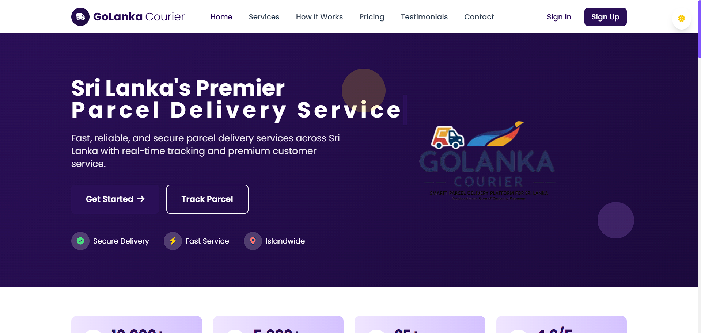
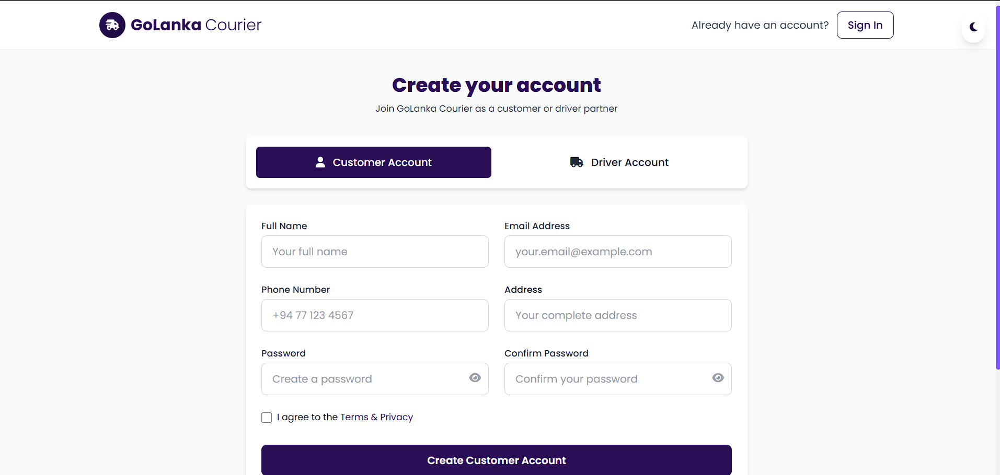
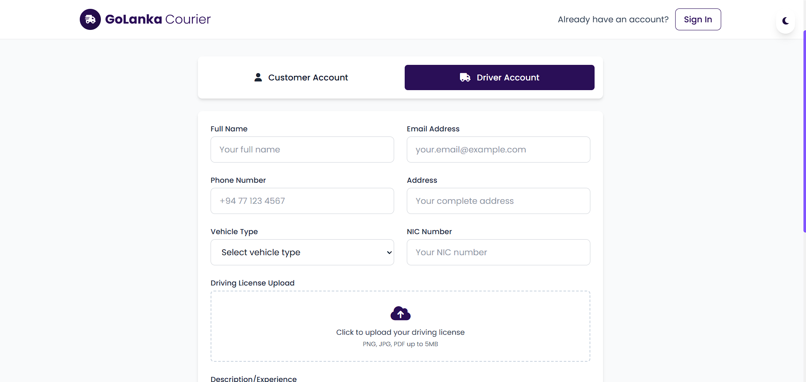
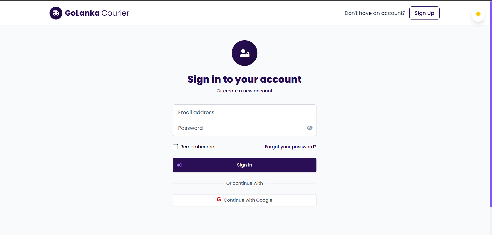
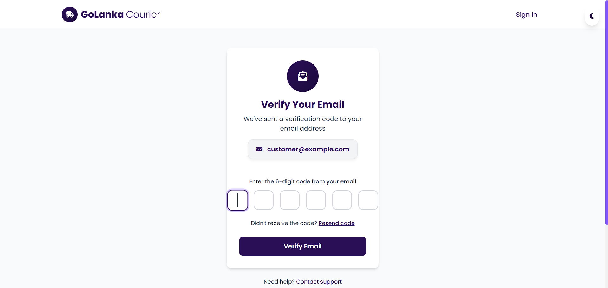
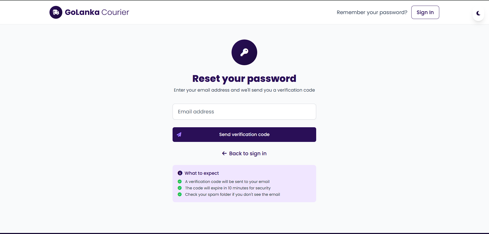
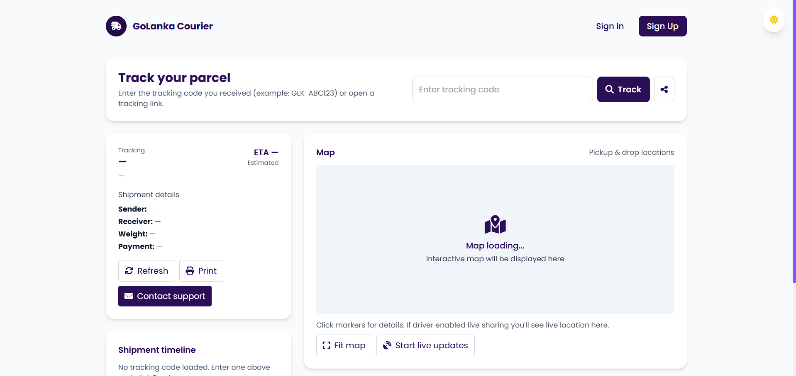
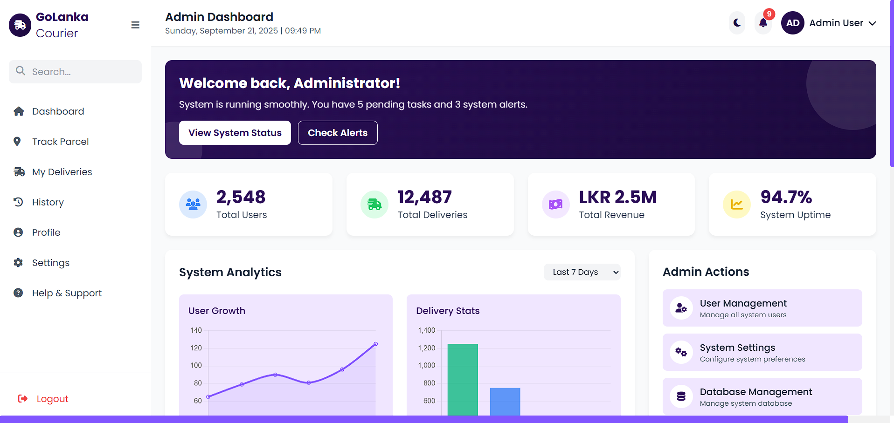
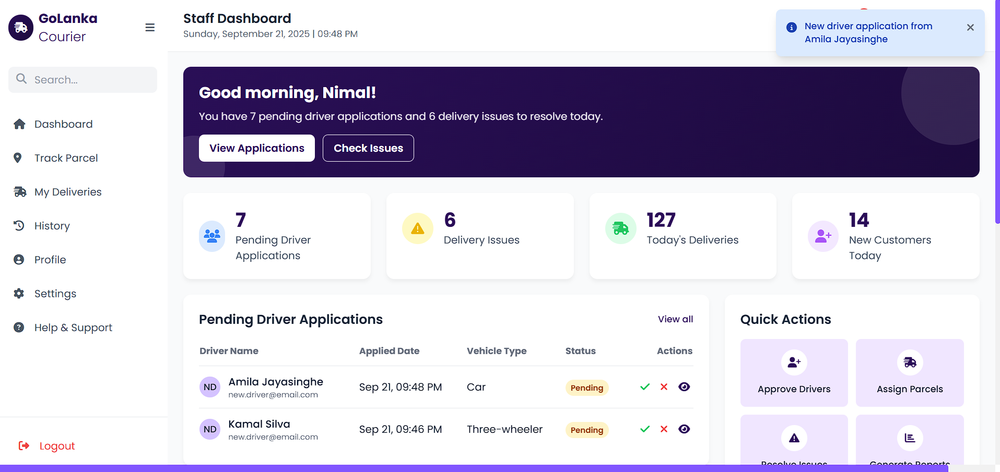
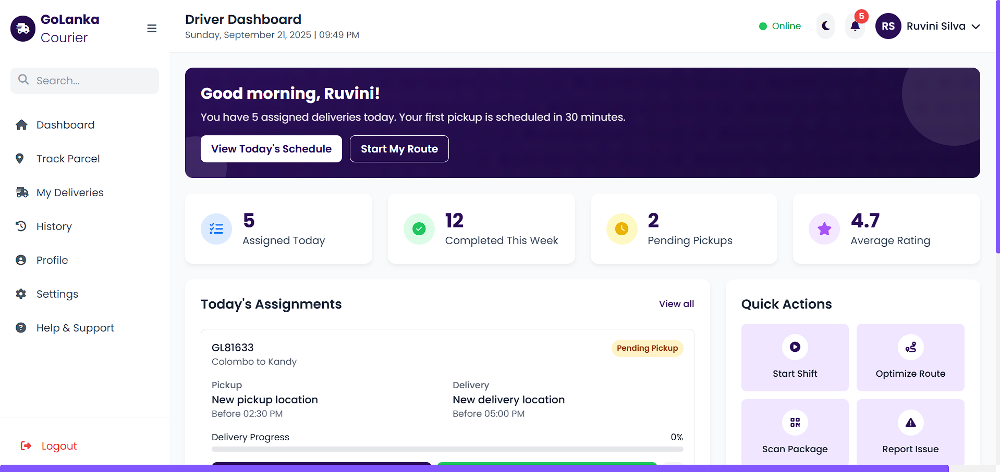

## Postman Tests

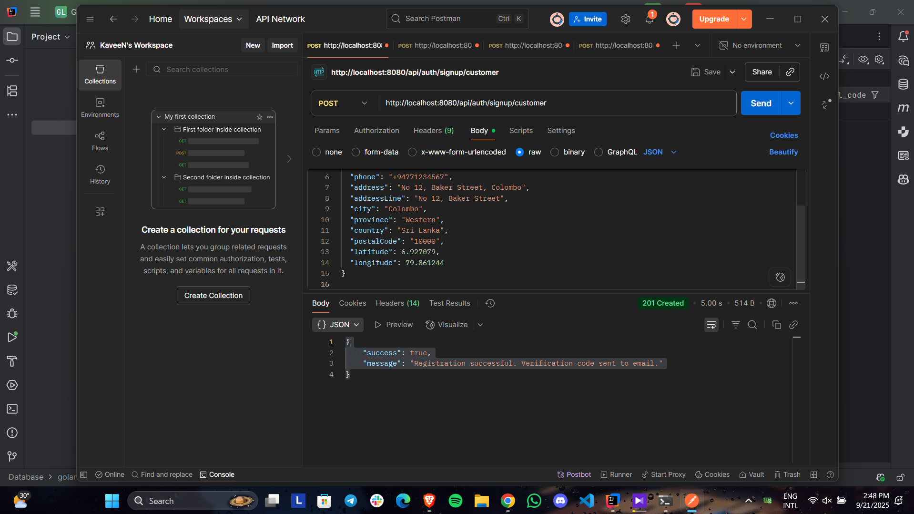
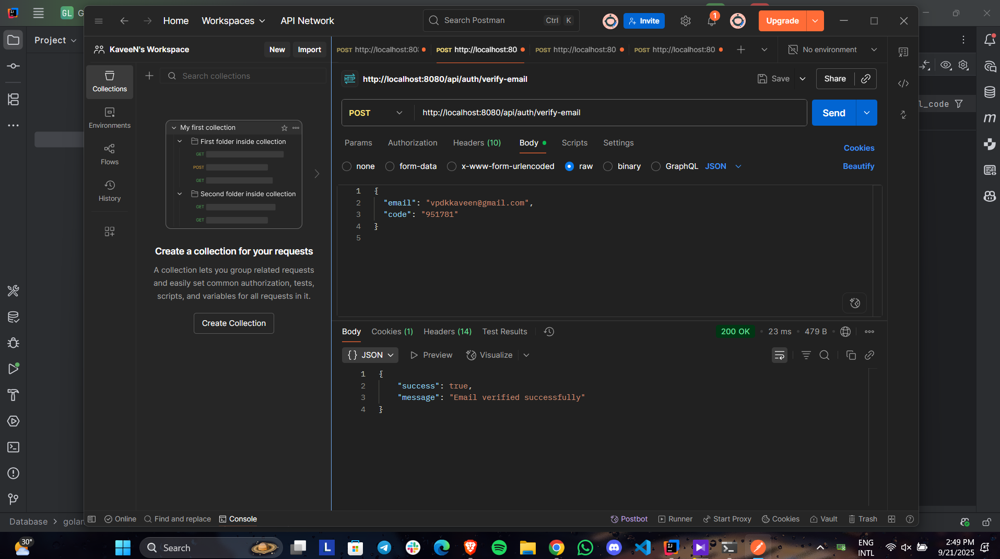
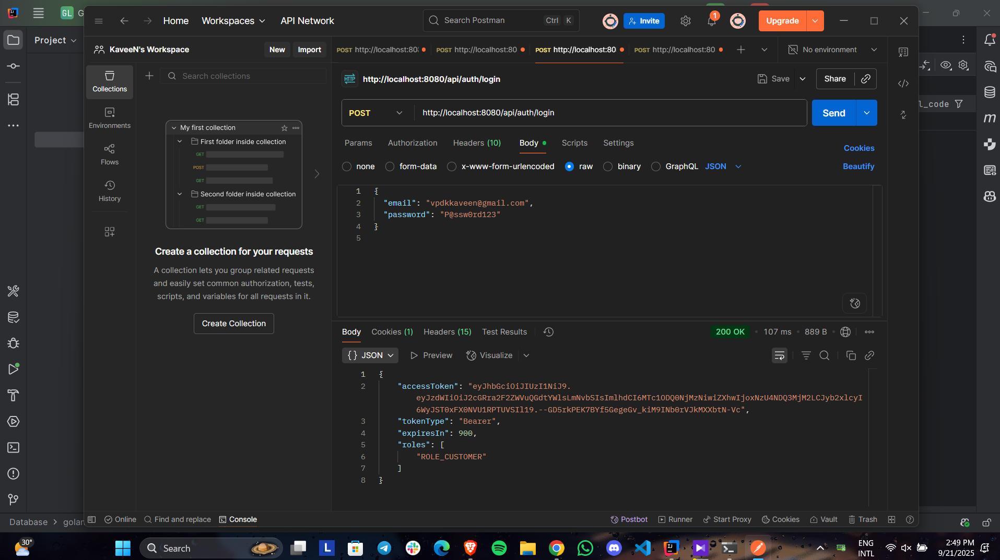
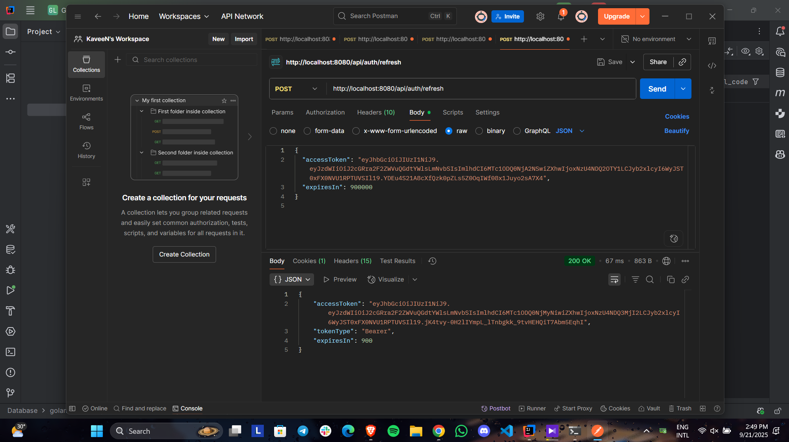

## Repository structure

```
.
GoLankaCourier-frontend/
├── assets/
│   ├── images/         # logos, illustrations
│   ├── icons/          # svg icons
│   └── fonts/          # custom webfonts
├── css/
│   ├── styles.css      # Tailwind custom utilities + animations (no build step)
│   └── theme.css       # color tokens + dark/light overrides
├── js/
│   ├── main.js         # bootstrapping: theme toggle, component loader
│   ├── auth.js         # signin/signup/verify/forgot-password flows
│   ├── parcel.js       # create/quote/track parcels
│   ├── driver.js       # driver dashboard actions
│   ├── staff.js        # staff dashboard actions
│   ├── admin.js        # admin console actions
│   ├── customer.js     # customer dashboard actions
│   ├── notifications.js# sweetalert toasts + notif dropdown + polling
│   └── script.js       # accessToken/refreshToken, cookies, apiFetch wrapper, role guard
├── components/
│   ├── header.html
│   ├── footer.html
│   ├── navbar.html
│   ├── sidebar.html
│   ├── parcel-card.html
│   ├── driver-card.html
│   └── modal.html
├── pages/
│   ├── signup.html
│   ├── signin.html
│   ├── forgot-password.html
│   ├── verify-email.html
│   ├── parcel-tracking.html
│   ├── profile.html
│   ├── dashboard-customer.html
│   ├── dashboard-driver.html
│   ├── dashboard-staff.html
│   └── dashboard-admin.html
├── index.html
└── README.md

```

```
GoLankaCourier-backend/
├── .github/
│   └── workflows/
│       └── ci.yml
├── docker/
│   ├── docker-compose.yml
│   └── mysql-init/
│       └── V1__init_schema.sql
├── db-migrations/
│   └── V1__init_schema.sql
├── src/
│   ├── main/
│   │   ├── java/
│   │   │   └── lk/
│   │   │       └── ijse/
│   │   │           └── edu/
│   │   │               └── backend/
│   │   │                   ├── GoLankaCourierApplication.java
│   │   │                   ├── config/
│   │   │                   │   ├── SecurityConfig.java
│   │   │                   │   ├── JwtConfig.java
│   │   │                   │   ├── MailConfig.java
│   │   │                   │   ├── CloudinaryConfig.java
│   │   │                   │   └── WebSocketConfig.java
│   │   │                   ├── controller/
│   │   │                   │   ├── AuthController.java
│   │   │                   │   ├── UserController.java
│   │   │                   │   ├── ParcelController.java
│   │   │                   │   ├── DriverController.java
│   │   │                   │   ├── StaffController.java
│   │   │                   │   ├── AdminController.java
│   │   │                   │   ├── PaymentController.java
│   │   │                   │   ├── WebhookController.java
│   │   │                   │   ├── NotificationController.java
│   │   │                   │   ├── FileController.java
│   │   │                   │   └── ReportController.java
│   │   │                   ├── dto/
│   │   │                   │   ├── ApiResponse.java
│   │   │                   │   ├── ErrorResponse.java
│   │   │                   │   ├── auth/
│   │   │                   │   │   ├── LoginRequest.java
│   │   │                   │   │   ├── LoginResponse.java
│   │   │                   │   │   ├── SignupCustomerRequest.java
│   │   │                   │   │   └── SignupDriverRequest.java
│   │   │                   │   ├── user/
│   │   │                   │   │   ├── UserDto.java
│   │   │                   │   │   └── UserUpdateRequest.java
│   │   │                   │   ├── parcel/
│   │   │                   │   │   ├── ParcelCreateRequest.java
│   │   │                   │   │   ├── ParcelUpdateStatusRequest.java
│   │   │                   │   │   └── ParcelDto.java
│   │   │                   │   ├── payment/
│   │   │                   │   │   ├── PaymentRequest.java
│   │   │                   │   │   └── PaymentDto.java
│   │   │                   │   ├── file/
│   │   │                   │   │   └── FileUploadResponse.java
│   │   │                   │   └── refresh/
│   │   │                   │       └── RefreshTokenRotateResult.java
│   │   │                   ├── entity/
│   │   │                   │   ├── User.java
│   │   │                   │   ├── UserAddress.java
│   │   │                   │   ├── DriverDocument.java
│   │   │                   │   ├── Branch.java
│   │   │                   │   ├── Parcel.java
│   │   │                   │   ├── ParcelHistory.java
│   │   │                   │   ├── ParcelProof.java
│   │   │                   │   ├── Payment.java
│   │   │                   │   ├── PaymentProvider.java
│   │   │                   │   ├── RefreshToken.java
│   │   │                   │   ├── EmailVerification.java
│   │   │                   │   ├── Notification.java
│   │   │                   │   ├── AuditLog.java
│   │   │                   │   ├── Rating.java
│   │   │                   │   └── WebhookLog.java
│   │   │                   ├── entity/enum/
│   │   │                   │   ├── Role.java
│   │   │                   │   ├── ParcelStatus.java
│   │   │                   │   ├── PaymentMethod.java
│   │   │                   │   ├── Payer.java
│   │   │                   │   ├── VerificationPurpose.java
│   │   │                   │   └── NotificationType.java
│   │   │                   ├── repository/
│   │   │                   │   ├── UserRepository.java
│   │   │                   │   ├── UserAddressRepository.java
│   │   │                   │   ├── DriverDocumentRepository.java
│   │   │                   │   ├── BranchRepository.java
│   │   │                   │   ├── ParcelRepository.java
│   │   │                   │   ├── ParcelHistoryRepository.java
│   │   │                   │   ├── ParcelProofRepository.java
│   │   │                   │   ├── PaymentRepository.java
│   │   │                   │   ├── PaymentProviderRepository.java
│   │   │                   │   ├── RefreshTokenRepository.java
│   │   │                   │   ├── EmailVerificationRepository.java
│   │   │                   │   ├── NotificationRepository.java
│   │   │                   │   ├── AuditLogRepository.java
│   │   │                   │   ├── RatingRepository.java
│   │   │                   │   └── WebhookLogRepository.java
│   │   │                   ├── security/
│   │   │                   │   ├── JwtUtil.java
│   │   │                   │   ├── JwtAuthenticationFilter.java
│   │   │                   │   └── CustomUserDetailsService.java
│   │   │                   ├── service/
│   │   │                   │   ├── AuthService.java
│   │   │                   │   ├── UserService.java
│   │   │                   │   ├── ParcelService.java
│   │   │                   │   ├── DriverDocumentService.java
│   │   │                   │   ├── FileStorageService.java
│   │   │                   │   ├── RefreshTokenService.java
│   │   │                   │   ├── EmailService.java
│   │   │                   │   └── NotificationService.java
│   │   │                   └── service/impl/
│   │   │                       ├── AuthServiceImpl.java
│   │   │                       ├── UserServiceImpl.java
│   │   │                       ├── ParcelServiceImpl.java
│   │   │                       ├── DriverDocumentServiceImpl.java
│   │   │                       ├── CloudinaryFileStorageService.java
│   │   │                       ├── RefreshTokenServiceImpl.java
│   │   │                       ├── EmailServiceImpl.java
│   │   │                       └── NotificationServiceImpl.java
│   │   └── resources/
│   │       ├── application.properties
│   │       ├── application-local.properties
│   │       ├── logback-spring.xml
│   │       ├── db/
│   │       │   └── V1__init_schema.sql
│   │       ├── static/
│   │       └── templates/
│   │           ├── email-verification.html
│   │           └── driver-approval.html
│   └── test/
│       └── java/
│           └── lk/ijse/edu/backend/
│               └── (unit & integration tests)
├── .env.example
├── README.md
└── pom.xml

```
---

## Setup & Run Instructions

### Prerequisites

* Java 17+
* Maven or Gradle
* Git
* SMTP account or Mailtrap for email testing

---

### Backend (Spring Boot)

1. Navigate to backend folder:
   ```bash
   cd backend
   ```

2. Configure `application.properties`:
   ```properties
   server.port=8080
   spring.datasource.url=jdbc:h2:mem:golanka;DB_CLOSE_DELAY=-1
   spring.datasource.driverClassName=org.h2.Driver
   spring.datasource.username=sa
   spring.datasource.password=
   spring.jpa.hibernate.ddl-auto=update
   golanka.jwt.secret=your-strong-secret-here
   golanka.jwt.expiresIn=3600
   spring.mail.host=smtp.mailtrap.io
   spring.mail.port=2525
   spring.mail.username=your-mailtrap-user
   spring.mail.password=your-mailtrap-pass
   ```

3. Build and run:
   ```bash
   mvn clean package
   mvn spring-boot:run
   ```

4. Backend will be available at: `http://localhost:8080`

---

### Frontend (static pages)

1. Serve the frontend files using a local server:
   ```bash
   cd frontend
   python -m http.server 5500
   ```

2. Open `http://localhost:5500/pages/auth/signin.html`

3. Ensure the API base is set correctly in the frontend:
   ```js
   window.API_BASE = "http://localhost:8080";
   ```

---

## API quick tests (curl)

Check server status:
```bash
curl -v http://localhost:8080/actuator/health
```

User login:
```bash
curl -X POST http://localhost:8080/api/auth/login \
  -H "Content-Type: application/json" \
  -d '{"email":"test@example.com","password":"password123"}'
```

---

## Troubleshooting tips

* **CORS errors**: Ensure backend has CORS configured for frontend origin
* **401 Unauthorized**: Check JWT token is being sent in Authorization header
* **Email failures**: Verify SMTP configuration in application.properties
* **Database issues**: Check H2 console at `http://localhost:8080/h2-console`

---

## About Me

**Name:** Dimantha Kaveen  
**Email:** dtkaviya1002@gmail.com

**YouTube video title:** "GoLanka Courier - Parcel Management System - Spring Boot Web Application Demo"

---

## License

This project is licensed under the MIT License - see the LICENSE file for details.